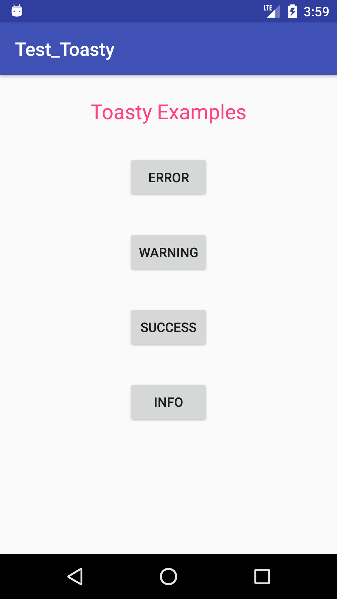
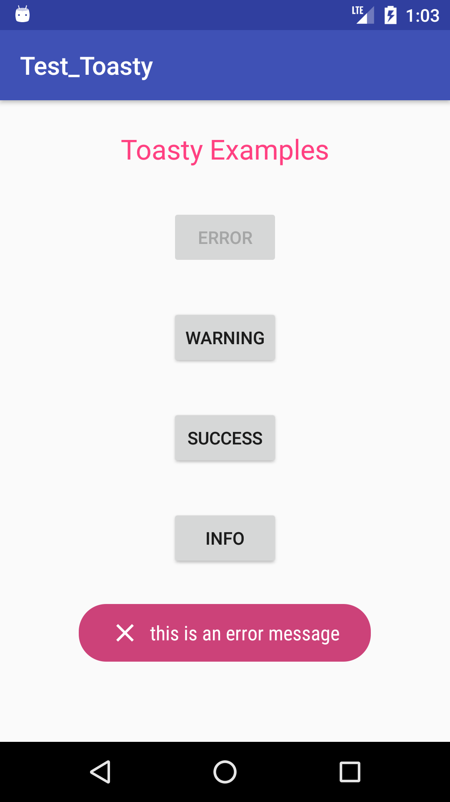
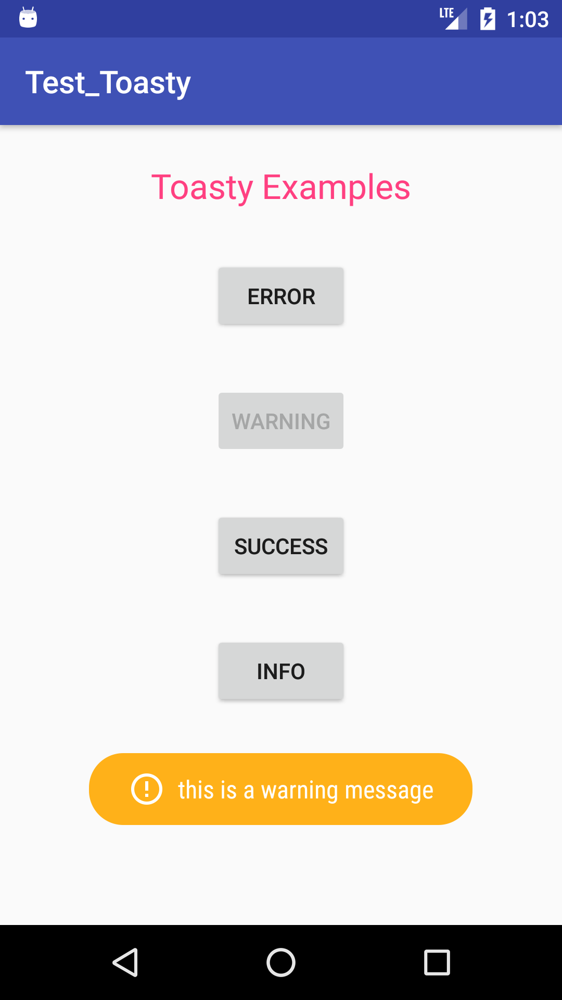
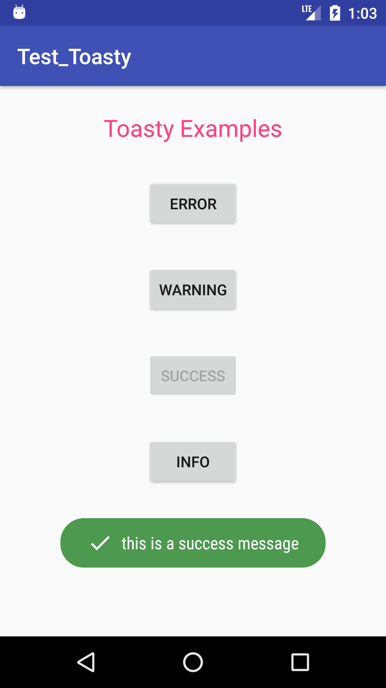
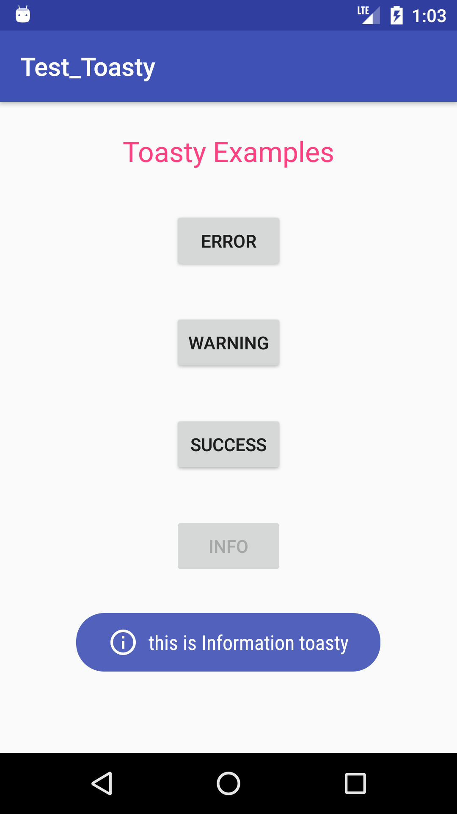

# TestToasty 


This App deals use of Toasty which is custom toast with steroids . You can also customize different Attribute of Toasty as Per requirement.

<div align="center">
	
</div>

---

## Prerequisites

Add this in your root `build.gradle` file:

```gradle
allprojects {
	repositories {
		...
		maven { url "https://jitpack.io" }
	}
}
```

---

## Dependency

Add this to your module's `build.gradle` file (make sure the version matches the JitPack badge above):

```gradle
dependencies {
	...
	compile 'com.github.GrenderG:Toasty:1.2.8'
}
```

---
> Snapshots for Error, Warning, Success, info Toasty

|       Error        |       Warning        |       Success        |       Info        |
| :----------------: | :------------------: | :------------------: | :---------------: |
|  |  |  |  |
